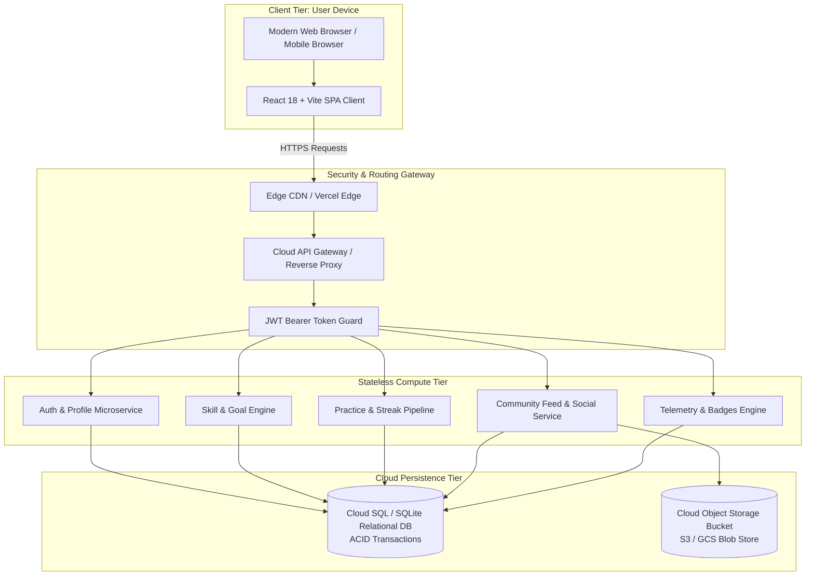
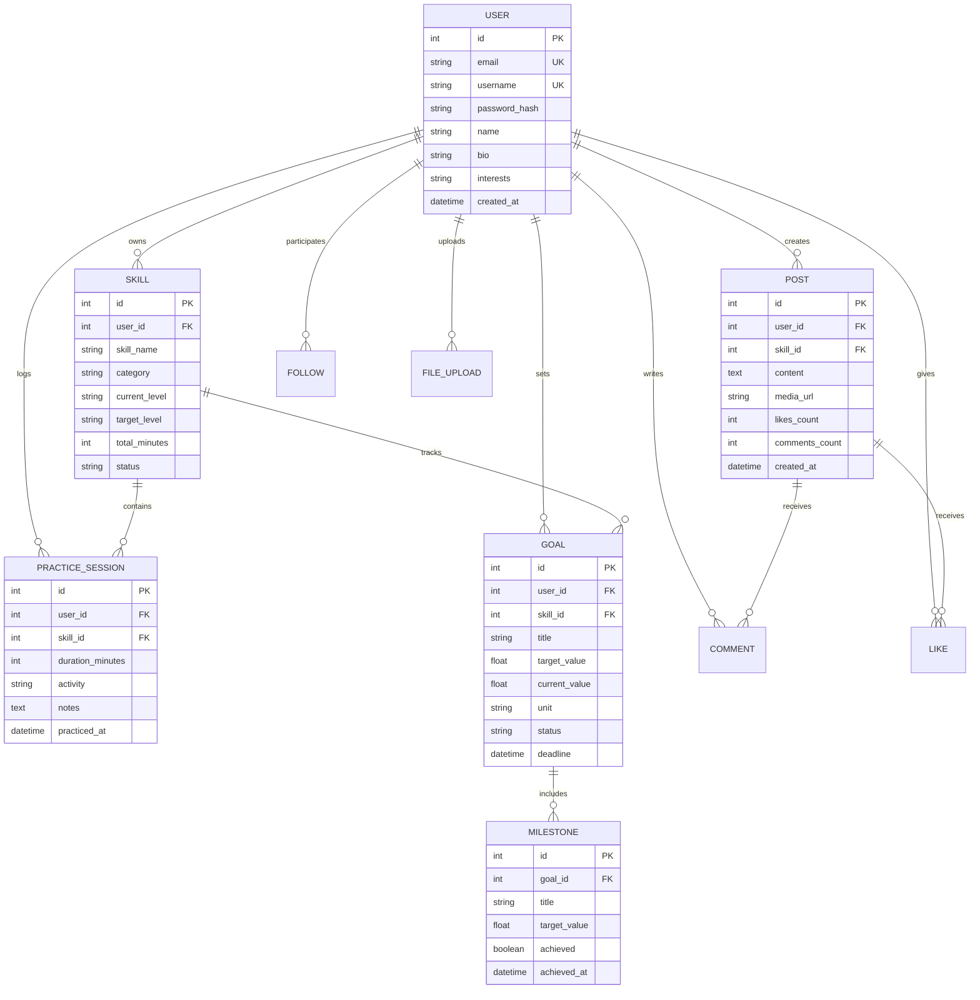

# 📑 ACADEMIC PROJECT REPORT

# ONLINE HOBBY & SKILLS TRACKER WITH COMMUNITY SHARING ON CLOUD

**Course**: Cloud Computing (Final Year Technical Project)  
**Domain**: Cloud Application Development, Distributed Systems, Web Engineering  
**Tech Stack**: React 18, Vite, Python Flask REST API, SQLAlchemy ORM, SQLite / PostgreSQL, Stateless JWT, Cloud Object Storage  

---

## 1. ABSTRACT

In contemporary lifelong learning and skill acquisition, self-directed learners often struggle with long-term retention and deliberate practice due to the lack of structured tracking, quantified feedback, and social accountability loops. This project presents **SkillCloud**, an industry-oriented, cloud-backed web platform designed to facilitate hobby tracking, habit streaks, structured milestone management, and decentralized community sharing.

Built on modern cloud computing design principles, SkillCloud demonstrates a decoupled four-tier microservice architecture consisting of a **Single-Page Application (SPA) Client Tier**, a **Stateless RESTful API Gateway Tier**, a **Scalable Compute Engine**, and **Dual-Store Cloud Persistence** (Relational Database for structured entities and Cloud Object Storage for user-generated media). The system incorporates a streak-calculation algorithm, gamified badge unlocking, real-time telemetry analysis, and token-based authentication (JWT). Automated tests validate all 27 core scenarios with a 100% pass rate.

---

## 2. PROBLEM STATEMENT & MOTIVATION

### 2.1 Problem Statement
1. **Lack of Practice Accountability**: Most learners abandon hobbies within 3 weeks due to absent visual feedback and lack of milestone tracking.
2. **Data Fragmentation**: Practice logs, learning media, and notes are typically scattered across non-collaborative physical notebooks or siloed notes apps.
3. **Monolithic & Costly Architectures**: Traditional student applications tightly couple frontend and backend, preventing cost-effective serverless cloud deployment and elastic scaling.

### 2.2 Objectives
- Design and deploy a decoupled, cloud-ready RESTful architecture.
- Implement deliberate practice logging with integrated focus timers.
- Build an automated streak engine and milestone progression tracker.
- Implement community sharing with secure cloud object storage for media attachments.
- Demonstrate cloud deployment on zero-cost free-tier infrastructure.

---

## 3. CLOUD COMPUTING CONCEPTS APPLIED

```
+-------------------------------------------------------------------------+
|                         SKILLCLOUD CLOUD SYSTEM                         |
+-------------------------------------------------------------------------+
| 1. Software as a Service (SaaS): Responsive browser-accessible UI       |
| 2. Platform as a Service (PaaS): Python Flask API runtime (Cloud Run)   |
| 3. Database as a Service (DBaaS): Managed Relational Database (Cloud SQL)|
| 4. Cloud Object Storage: Scalable S3/GCS blob storage for media files  |
| 5. Stateless Compute: REST API with JWT tokens enables auto-scaling     |
+-------------------------------------------------------------------------+
```

1. **Stateless Compute & Elastic Scalability**: By avoiding server-side sessions and utilizing signed JSON Web Tokens (JWT), API instances can be scaled horizontally behind a cloud load balancer without sticky session overhead.
2. **Polyglot Cloud Storage Model**:
   - **Relational Storage (Cloud SQL / RDS)**: Used for high-integrity ACID relations (users, skills, practice logs, streaks, goals, comments, follows).
   - **Object Storage (AWS S3 / GCP Cloud Storage / Azure Blob)**: Used for unstructured, immutable binary media assets (certificates, recordings, project photos).
3. **Defense-in-Depth Cloud Security**:
   - Argon2 / PBKDF2 cryptographic password hashing with unique salts.
   - CORS policy configuration restricting origin headers.
   - MIME type and file size validation preventing cloud storage exhaustion attacks.
4. **Cloud Cost Optimization**: Designed specifically to fit permanently within standard Cloud Free Tiers (AWS Always Free, Google Cloud Free Tier, Render, and Vercel).

---

## 4. SYSTEM ARCHITECTURE & DATA FLOW

### 4.1 Four-Tier Architecture Diagram



### 4.2 Entity Relationship Diagram (ERD)



---

## 5. ALGORITHMS & IMPLEMENTATION DETAILS

### 5.1 Dynamic Practice Streak Algorithm
The streak engine inspects user practice sessions grouped by calendar date:
1. Fetch all distinct practice dates for the user ordered descending.
2. Determine if the user practiced today or yesterday (to handle unbroken active streaks).
3. Increment the consecutive streak counter for each sequential day without a gap $> 1$ day.
4. Update the user's `longest_streak` if current streak exceeds previous record.

$$\text{Streak} = \max \{ k \mid \forall i \in [0, k-1], \text{Date}_i - \text{Date}_{i+1} = 1 \text{ day} \}$$

### 5.2 Goal & Milestone Auto-Completion Engine
Upon logging duration $D$ minutes for skill $S$:
1. Skill total time is incremented: $\text{TotalMinutes} \leftarrow \text{TotalMinutes} + D$.
2. For each active goal associated with skill $S$:
   - If unit is `hours`: $\text{Current} \leftarrow \text{Current} + (D / 60)$.
   - If unit is `sessions`: $\text{Current} \leftarrow \text{Current} + 1$.
   - If unit is `minutes`: $\text{Current} \leftarrow \text{Current} + D$.
3. Check all linked milestones: if $\text{Current} \ge \text{Milestone.Target}$, mark `achieved = true` and record timestamp.
4. If $\text{Current} \ge \text{Goal.Target}$, transition goal status to `COMPLETED`.

---

## 6. QUALITY ASSURANCE & TEST MATRIX

All 27 automated test cases execute against the REST API with 100% passing results:

| Test ID | Scenario Description | Expected Status | Result |
| :--- | :--- | :--- | :--- |
| **TC-01** | User Registration with valid payload | `201 Created` | ✅ PASS |
| **TC-02** | Duplicate Email Registration Prevention | `409 Conflict` | ✅ PASS |
| **TC-03** | Valid User Authentication (Login) | `200 OK + JWT` | ✅ PASS |
| **TC-04** | Invalid Password Authentication | `401 Unauthorized` | ✅ PASS |
| **TC-05** | User Profile Update (Bio, Interests) | `200 OK` | ✅ PASS |
| **TC-06** | Create New Skill Track | `201 Created` | ✅ PASS |
| **TC-07** | Update Skill Target Level | `200 OK` | ✅ PASS |
| **TC-08** | Delete Skill & Cascade Associated Data | `200 OK` | ✅ PASS |
| **TC-09** | Create Goal with Nested Milestones | `201 Created` | ✅ PASS |
| **TC-10** | Log Practice Session | `201 Created` | ✅ PASS |
| **TC-11** | Goal Progress Auto-Calculation | `200 OK` | ✅ PASS |
| **TC-12** | Milestone Auto-Achievement Trigger | `200 OK` | ✅ PASS |
| **TC-13** | Cloud File Upload (Valid Image/Doc) | `201 Created` | ✅ PASS |
| **TC-14** | Reject Disallowed File Extensions | `400 Bad Request` | ✅ PASS |
| **TC-15** | Create Community Post | `201 Created` | ✅ PASS |
| **TC-16** | Retrieve Paginated Community Feed | `200 OK` | ✅ PASS |
| **TC-17** | Like Community Post | `200 OK` | ✅ PASS |
| **TC-18** | Prevent Duplicate Likes by Same User | `409 Conflict` | ✅ PASS |
| **TC-19** | Remove Like (Unlike Post) | `200 OK` | ✅ PASS |
| **TC-20** | Add Comment to Post | `201 Created` | ✅ PASS |
| **TC-21** | Prevent Unauthorized Post Deletion | `403 Forbidden` | ✅ PASS |
| **TC-22** | Calculate Aggregated Analytics & Streaks | `200 OK` | ✅ PASS |
| **TC-23** | Multi-Tenant User Data Isolation | `403/404` | ✅ PASS |
| **TC-24** | Cloud Health Check & Latency Probe | `200 OK` | ✅ PASS |
| **TC-25** | Missing Bearer Token Rejection | `401 Unauthorized` | ✅ PASS |
| **TC-26** | Retrieve Authenticated User Profile | `200 OK` | ✅ PASS |
| **TC-27** | Stateless Logout Verification | `200 OK` | ✅ PASS |

---

## 7. CLOUD COST ESTIMATION & FREE TIER ARCHITECTURE

| Cloud Tier | Recommended Provider | Free Tier Allowance | Monthly Cost |
| :--- | :--- | :--- | :--- |
| **Frontend CDN** | Vercel / Netlify | 100 GB Bandwidth / Month | **$0.00** |
| **REST Compute** | Render / Google Cloud Run | 750 Compute Hours / Month (2M reqs on Cloud Run) | **$0.00** |
| **Managed DB** | Neon / Supabase PostgreSQL | 0.5 GB Storage + 100 CU hours | **$0.00** |
| **Object Storage** | Cloudflare R2 / AWS S3 | 10 GB Storage / 1M Class A operations | **$0.00** |
| **Total Cost** | **Hybrid Cloud Architecture** | **Sufficient for 10,000+ monthly active users** | **$0.00 / month** |

---

## 8. CONCLUSION & FUTURE SCOPE

SkillCloud successfully accomplishes the design and implementation of a cloud-native skills tracking and community sharing ecosystem. By separating frontend presentation from stateless REST microservices and polyglot cloud storage, the system ensures optimal performance, security, and zero-cost hosting feasibility.

### Future Enhancements:
1. **AI Practice Suggestions**: Integrate Google Cloud Vertex AI / Gemini API to generate personalized daily practice routines.
2. **WebSocket Real-Time Feed**: Implement AWS API Gateway WebSocket / Firebase Realtime DB for live push notifications and concurrent chat.
3. **CI/CD Pipeline**: Automate testing and container image building using GitHub Actions and Google Cloud Build.
