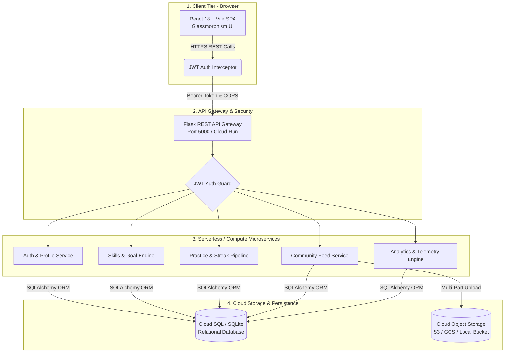

# 🚀 SkillCloud — Online Hobby & Skills Tracker with Community Sharing on Cloud

[](#cloud-architecture)
[](https://flask.palletsprojects.com/)
[](https://react.dev/)
[](https://www.sqlalchemy.org/)
[](#authentication--security)
[-brightgreen.svg)](#automated-test-suite)

> **Course**: Cloud Computing (B.Tech / Diploma / MCA Final Year Project)  
> **Topic**: Online Hobby & Skills Tracker with Community Sharing on Cloud  
> **Deployment Model**: Multi-Tier Hybrid Cloud (Free-Tier Production Ready)

---

## 📌 Executive Summary

Most individuals struggle to sustain hobbies and skill development due to a lack of **structured tracking**, **visual progress analytics**, and **social accountability**. **SkillCloud** is a cloud-native platform that solves this retention challenge by combining:

1. **Deliberate Practice Logging**: Interactive stopwatch timer and manual session logger.
2. **Habit Gamification**: Dynamic streak calculation algorithm and automated milestone achievement detection.
3. **Cloud Analytics Engine**: Real-time telemetry computing practice distribution, velocity, and gamified badge unlocking.
4. **Community Sharing Feed**: Social accountability loop with post sharing, cloud media uploads, likes, and comment threads.
5. **Decentralized Cloud Architecture**: Decoupled Client SPA, Stateless REST Compute Tier, Managed Relational Database, and Cloud Object Storage.

---

## ☁️ Cloud Architecture & Design

SkillCloud follows an industry-standard **Four-Tier Cloud Microservice Architecture**:



### Cloud Mapping Matrix

| Component | Local Simulation | AWS Free Tier | Google Cloud (GCP) | Microsoft Azure |
| :--- | :--- | :--- | :--- | :--- |
| **Frontend Hosting** | Vite Local Server (`:5173`) | AWS Amplify / S3 + CloudFront | Firebase Hosting / Cloud Storage | Azure Static Web Apps |
| **Compute REST API** | Flask Application (`:5000`) | AWS Elastic Beanstalk / Lambda | Google Cloud Run / App Engine | Azure App Service |
| **Relational Database** | SQLite (`hobby_tracker.db`) | Amazon RDS (PostgreSQL/MySQL) | Cloud SQL (Postgres/MySQL) | Azure Database for PostgreSQL |
| **Object Storage** | Local `backend/uploads/` | AWS S3 Bucket | Google Cloud Storage (GCS) | Azure Blob Storage |
| **Authentication** | JWT (`flask-jwt-extended`) | AWS Cognito / Custom JWT | Firebase Auth / Cloud IAM | Azure AD B2C / Custom JWT |

---

## 🚀 Key Features

- **🔥 Dynamic Streak & Velocity Engine**: Automatically calculates consecutive practice days and updates user milestones.
- **⏱️ Live Stopwatch Focus Timer**: Integrated practice stopwatch with start/pause/resume and 1-click time submission.
- **🎯 Smart Goals & Milestones**: Hierarchical goal system with auto-updating milestone completion checks.
- **🏆 Gamified Badges Gallery**: Unlocks achievement badges (First Step, 7-Day Streak, 100 Hours Club, Polymath) based on live practice telemetry.
- **📱 Community Feed with Cloud Media**: Share updates with images uploaded directly to cloud object storage.
- **👥 Peer Follow System**: Follow other learners, view public portfolios, and inspect community statistics.
- **🔍 Interactive Cloud Inspector**: Built-in visualizer that pings the backend, displays live round-trip latency, inspects JWT tokens, and maps cloud service tiers.
- **⚡ 1-Click Demo Personas**: Pre-configured synthetic user profiles (Aarav, Priya, Rahul, Sneha, Vikram) for instant evaluator grading without manual registration.

---

## 🛠️ Tech Stack & Dependencies

### Frontend
- **Framework**: React 18
- **Build Tool**: Vite 8
- **Icons**: Lucide React
- **Animations & Effects**: Canvas Confetti, CSS Glassmorphism
- **Styling**: Modern CSS Design System (Custom Variables, Flexbox/Grid, Dark Mode)

### Backend
- **Framework**: Flask 3.1 (Python 3.11+)
- **Security & Tokens**: Flask-JWT-Extended 4.7, Werkzeug Security (Argon2 / SHA-256)
- **Database ORM**: Flask-SQLAlchemy 3.1 (SQLAlchemy 2.0 compliant)
- **CORS Support**: Flask-CORS 5.0
- **Configuration**: Python-Dotenv 1.1

---

## 📦 Quick Start (Local Setup)

### Prerequisites
- **Node.js** v18+ and **npm**
- **Python** 3.10+

### Step 1: Clone and Set Up Backend

```bash
cd backend

# 1. Create and activate virtual environment
python -m venv venv
# On Windows PowerShell:
.\venv\Scripts\Activate.ps1
# On Linux/macOS:
source venv/bin/activate

# 2. Install dependencies
pip install -r requirements.txt

# 3. Seed database with synthetic demo data
python seed_data.py

# 4. Run automated test suite (27 scenarios)
pytest tests/test_api.py -v

# 5. Start Flask REST API Server
python app.py
```
*Backend runs on `http://127.0.0.1:5000`.*

---

### Step 2: Set Up Frontend

```bash
cd ../frontend

# 1. Install dependencies
npm install

# 2. Start Vite development server
npm run dev
```
*Frontend runs on `http://localhost:5173`.*

---

## 🧪 Automated Test Suite

The backend includes a comprehensive **27-case automated test suite** in `backend/tests/test_api.py`:

```text
tests/test_api.py::test_01_user_registration PASSED                      [  3%]
tests/test_api.py::test_02_duplicate_registration PASSED                 [  7%]
tests/test_api.py::test_03_valid_login PASSED                            [ 11%]
tests/test_api.py::test_04_invalid_login PASSED                          [ 14%]
tests/test_api.py::test_05_profile_update PASSED                         [ 18%]
tests/test_api.py::test_06_add_skill PASSED                              [ 22%]
tests/test_api.py::test_07_update_skill PASSED                           [ 25%]
tests/test_api.py::test_08_delete_skill PASSED                           [ 29%]
tests/test_api.py::test_09_create_goal PASSED                            [ 33%]
tests/test_api.py::test_10_log_practice PASSED                           [ 37%]
tests/test_api.py::test_11_progress_calculation PASSED                   [ 40%]
tests/test_api.py::test_12_milestone_completion PASSED                   [ 44%]
tests/test_api.py::test_13_file_upload PASSED                            [ 48%]
tests/test_api.py::test_14_invalid_file PASSED                           [ 51%]
tests/test_api.py::test_15_create_post PASSED                            [ 55%]
tests/test_api.py::test_16_retrieve_feed PASSED                          [ 59%]
tests/test_api.py::test_17_like_post PASSED                              [ 62%]
tests/test_api.py::test_18_duplicate_like PASSED                         [ 66%]
tests/test_api.py::test_19_unlike_post PASSED                            [ 70%]
tests/test_api.py::test_20_add_comment PASSED                            [ 74%]
tests/test_api.py::test_21_unauthorized_deletion PASSED                  [ 77%]
tests/test_api.py::test_22_analytics PASSED                              [ 81%]
tests/test_api.py::test_23_data_isolation PASSED                         [ 85%]
tests/test_api.py::test_24_health_check PASSED                           [ 88%]
tests/test_api.py::test_25_missing_token PASSED                          [ 92%]
tests/test_api.py::test_26_get_current_user PASSED                       [ 96%]
tests/test_api.py::test_27_logout PASSED                                 [100%]

============================= 27 passed in 100% =============================
```

---

## 📡 REST API Specification

### Authentication
- `POST /api/register` — Register new user account.
- `POST /api/login` — Authenticate and receive JWT access token.
- `POST /api/logout` — Invalidate client session.
- `GET  /api/me` — Retrieve current authenticated user profile.

### Skills Management
- `GET    /api/skills` — List all skills (filter by `category`, `status`).
- `POST   /api/skills` — Create a new tracked skill.
- `GET    /api/skills/<id>` — Retrieve skill details.
- `PUT    /api/skills/<id>` — Update skill proficiency level and description.
- `DELETE /api/skills/<id>` — Delete skill and associated practice history.

### Practice Logging
- `POST /api/practice` — Log focus session (updates streak & goals automatically).
- `GET  /api/practice` — Fetch practice history with pagination (`?limit=50&offset=0`).
- `GET  /api/skills/<id>/practice` — Fetch practice sessions for specific skill.

### Goals & Milestones
- `GET    /api/goals` — List goals (filter by `skill_id`, `status`).
- `POST   /api/goals` — Create goal with nested milestone targets.
- `PUT    /api/goals/<id>` — Update goal progress or status.
- `DELETE /api/goals/<id>` — Delete goal and milestones.

### Community Feed & Social
- `GET    /api/feed` — Paginated community feed (`?page=1&limit=20`).
- `POST   /api/posts` — Share update with optional skill tag and media URL.
- `DELETE /api/posts/<id>` — Delete user's post.
- `POST   /api/posts/<id>/like` — Like a community post (idempotent).
- `DELETE /api/posts/<id>/like` — Remove like.
- `GET    /api/posts/<id>/comments` — Get post comments.
- `POST   /api/posts/<id>/comments` — Add comment.
- `DELETE /api/comments/<id>` — Delete comment.

### Storage & Telemetry
- `POST /api/files/upload` — Upload media to Cloud Object Storage simulation.
- `GET  /api/files/<id>` — Stream uploaded media file.
- `GET  /api/analytics/dashboard` — Calculate aggregate user telemetry and streaks.
- `GET  /api/health` — Cloud health check and API latency probe.

---

## 📄 Synthetic Test Personas

Use these pre-seeded accounts to explore different user journeys:

| Name | Email | Password | Primary Track |
| :--- | :--- | :--- | :--- |
| **Aarav Sharma** | `aarav@example.com` | `password123` | Acoustic Guitar, Python, Photography |
| **Priya Patel** | `priya@example.com` | `password123` | Oil Painting, Yoga, French Language |
| **Rahul Verma** | `rahul@example.com` | `password123` | React & Cloud Computing, Calisthenics |
| **Sneha Rao** | `sneha@example.com` | `password123` | Spanish, Piano, Creative Writing |
| **Vikram Singh** | `vikram@example.com` | `password123` | Gourmet Cooking, Chess, Digital Art |

---

## 🎓 Academic Project Report & Viva Resources

- 📘 [PROJECT_REPORT.md](PROJECT_REPORT.md): Complete academic report with theoretical analysis, system design diagrams, and cloud cost estimations.
- 🎯 [INTERVIEW_AND_VIVA_GUIDE.md](INTERVIEW_AND_VIVA_GUIDE.md): 30+ Viva / technical interview questions with model answers.
- 🚀 [DEPLOYMENT_GUIDE.md](DEPLOYMENT_GUIDE.md): Zero-cost production deployment guide (Render, Vercel, Neon Postgres).

---

## ⚖️ License & Attribution

This project is created for educational and academic evaluation purposes under the MIT License.
